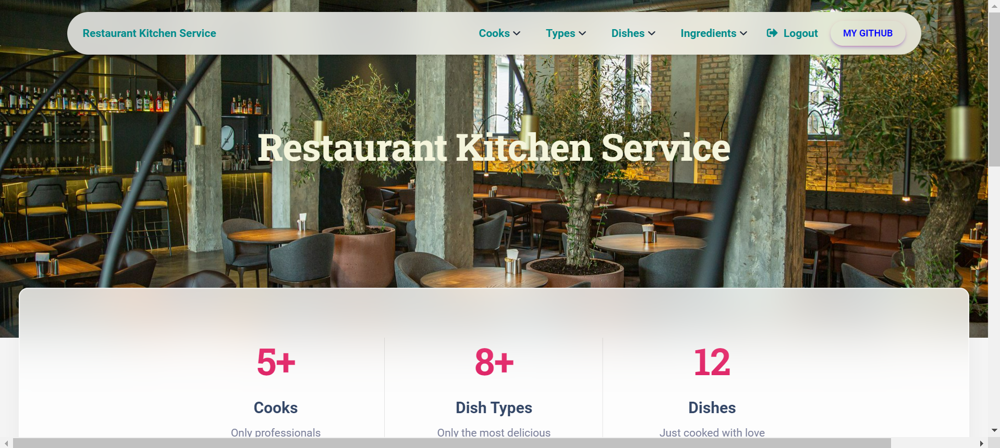
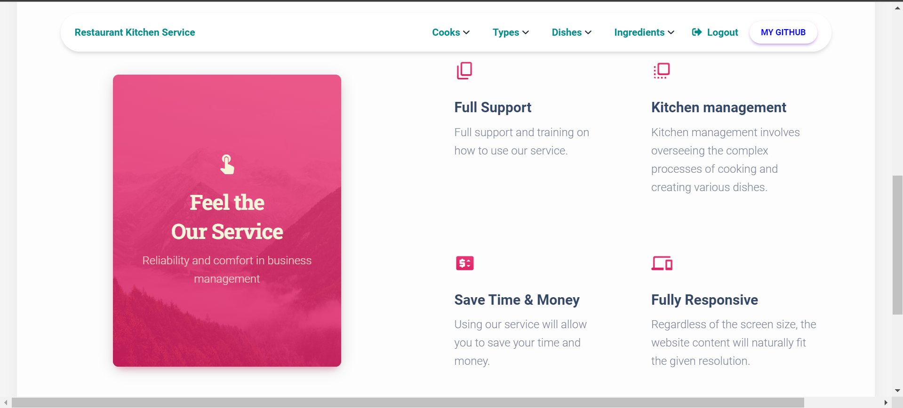
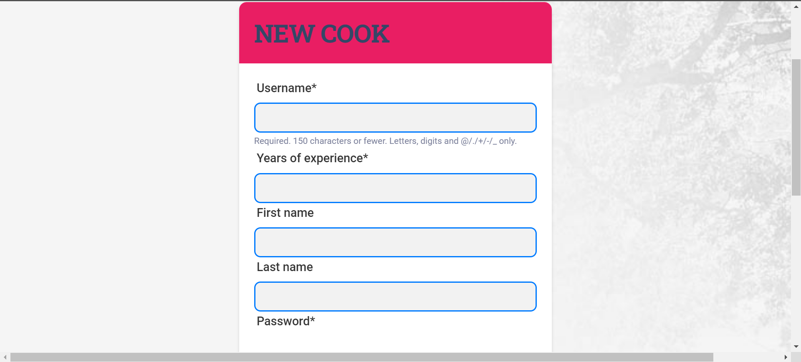
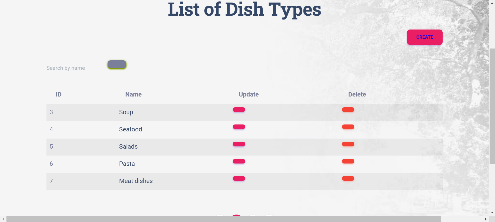
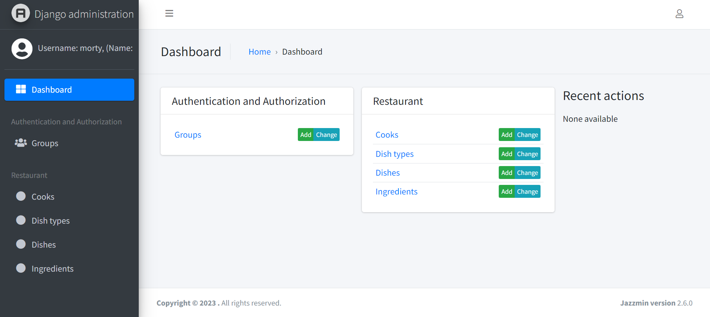

# Restaurant Kitchen Service Project
# Account for using the application:
*  login: example
* password: First1996

Restaurant Kitchen Service is a web application that enables restaurant managers to manage chef profiles,
food types, dishes, and ingredients for dishes. Chefs can choose the dishes they want to prepare, or the manager can 
assign them to specific dishes.
[Restaurant Kitchen Service Project deployed to render](https://restaurant-service-mate.onrender.com/)

## Installing / Getting started:
```shell
Python 3 must be installed
To get started, you need to clone the repository from GitHub: https://github.com/Morty67/restaurant_kitchen_service
cd restaurant-kitchen-service/
python -m venv venv
venv\Scripts\activate (on Windows)
source venv/bin/activate (on macOS)
pip install -r requirements.txt
python manage.py runserver
```
## Features:

*  Create and manage chef profiles
*  Create and manage food types
*  Create and manage dishes
*  Create and manage ingredients for dishes
*  Assign chefs to specific dishes

## Demo






